# Pulse Video Platform

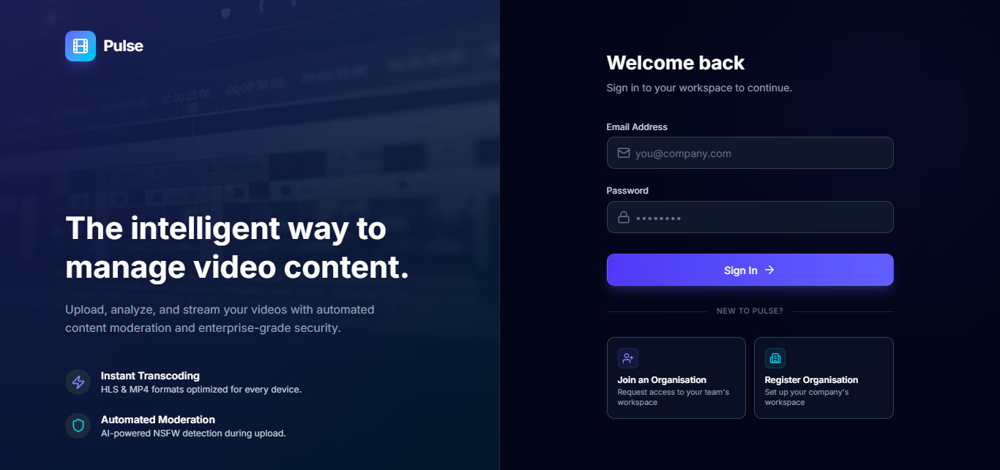

Pulse is a comprehensive, multi-tenant video platform that enables users to securely upload, process, and stream videos. It features an automated AI-driven content moderation pipeline that detects sensitive material (adult, violent, racy) and an adaptive streaming service.

---

###  Live Links
- **Live Demo**: https://video-analyser-pulse.vercel.app/login

---

##  Architecture Overview

Pulse follows a modern, decoupled client-server architecture.

### System Architecture

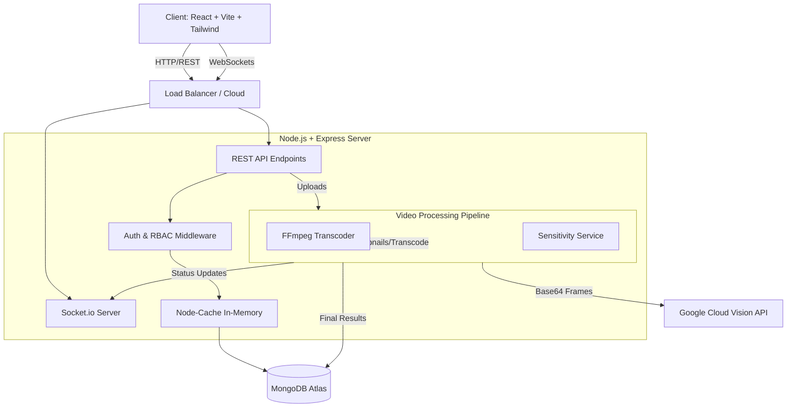

### Video Processing Flow (Sequence)

```mermaid
sequenceDiagram
    participant User
    participant Frontend
    participant Backend
    participant FFmpeg
    participant GoogleVision
    participant Database

    User->>Frontend: Uploads Video File
    Frontend->>Backend: POST /api/videos/upload
    Backend->>Database: Create Video (Status: Processing)
    Backend-->>Frontend: 201 Created (Pipeline started in background)
    
    rect rgb(30, 41, 59)
        Note right of Backend: Asynchronous Pipeline
        Backend->>Frontend: Socket: "Extracting Metadata"
        Backend->>FFmpeg: ffprobe (Get duration, resolution)
        
        Backend->>Frontend: Socket: "Extracting Frames"
        Backend->>FFmpeg: Extract 1 frame per 2 seconds
        
        Backend->>Frontend: Socket: "Analysing Sensitivity"
        Backend->>GoogleVision: Send Base64 frames (SafeSearch)
        GoogleVision-->>Backend: Return Threat Likelihoods
        
        Backend->>Frontend: Socket: "Transcoding Video"
        Backend->>FFmpeg: Transcode to H.264 (720p & 360p)
        
        Backend->>Database: Save processed paths & sensitivity scores
        Backend->>Frontend: Socket: "Completed"
    end
```

---

##  Screenshots

###  1. Login Page
<p align="center">
  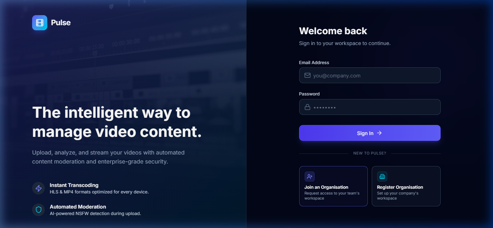
</p>

---

###  2. Register an Organisation (Create New Org + Admin Account)
<p align="center">
  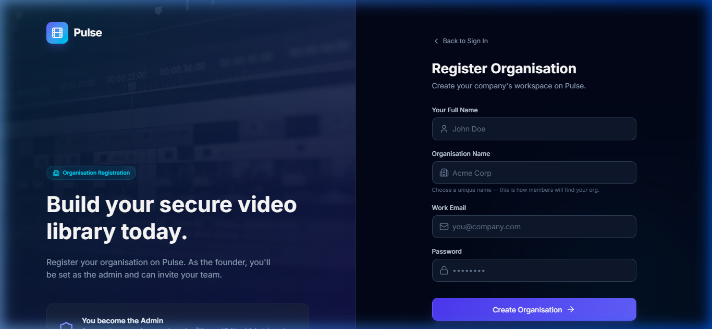
</p>

---

###  3. Join an Existing Organisation (User Registration)
<p align="center">
  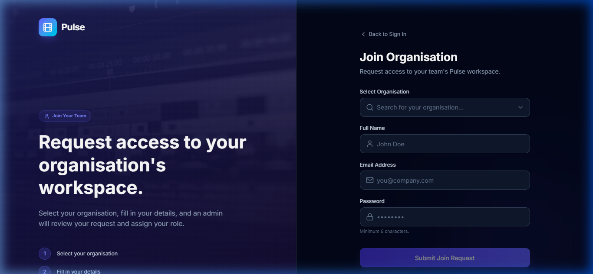
</p>

---

###  4. Join Request Submitted (Waiting for Admin Approval)
<p align="center">
  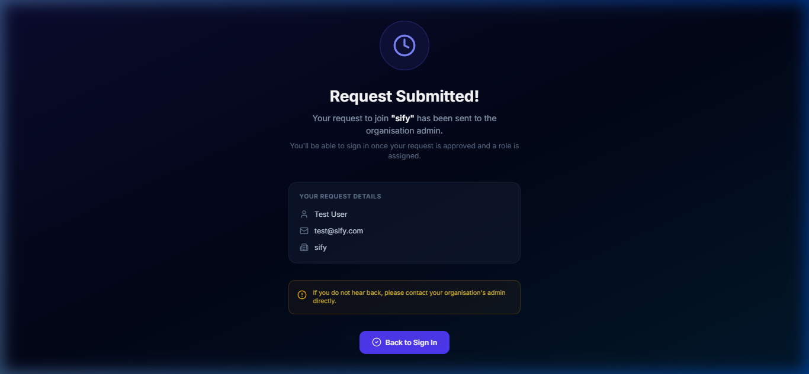
</p>

---

###  5. Dashboard (Active — with Videos)
<p align="center">
  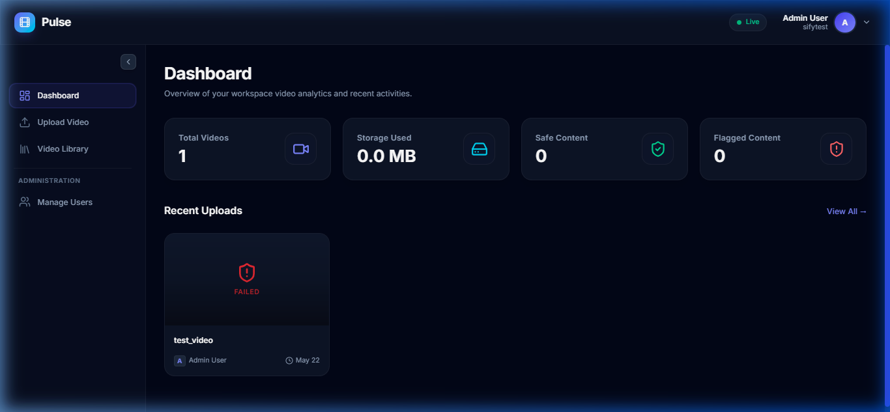
</p>

---

###  6. Dashboard (First Login — No Videos Yet)
<p align="center">
  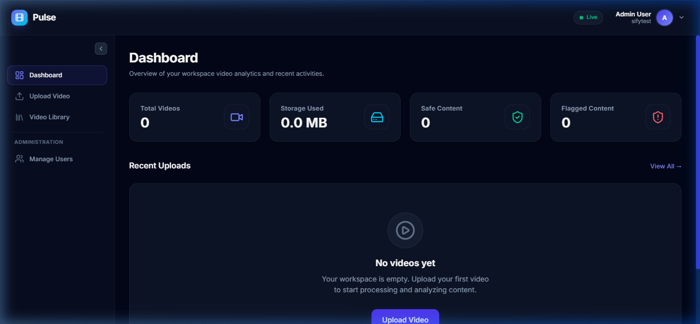
</p>

---

###  7. Admin Panel — Manage Users
<p align="center">
  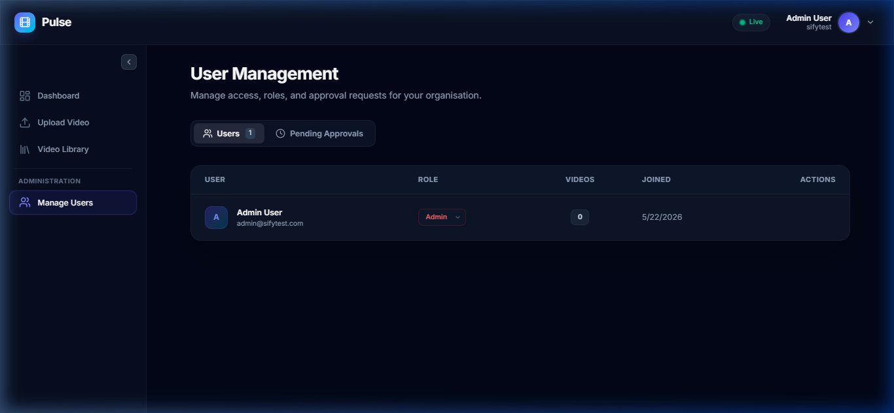
</p>

---

###  8. Admin Panel — Pending Approval Requests
<p align="center">
  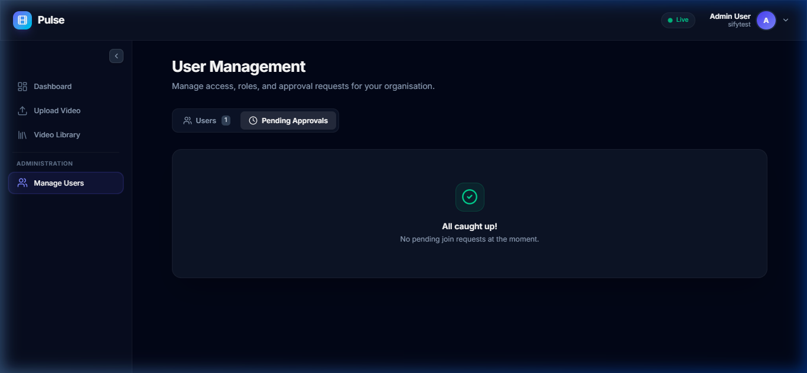
</p>

---

###  9. Upload Video Page
<p align="center">
  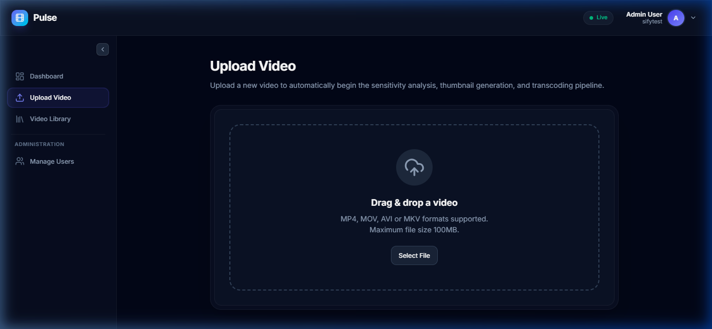
</p>

---

###  10. Video Processing in Progress (Real-Time Progress Bar)
<p align="center">
  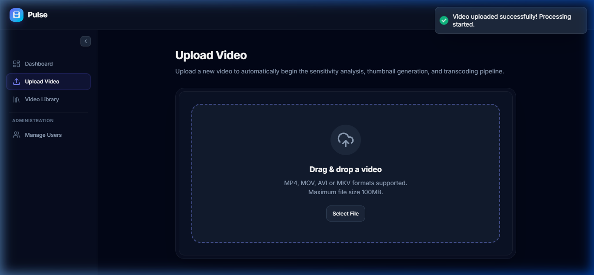
</p>

---

###  11. Video Library
<p align="center">
  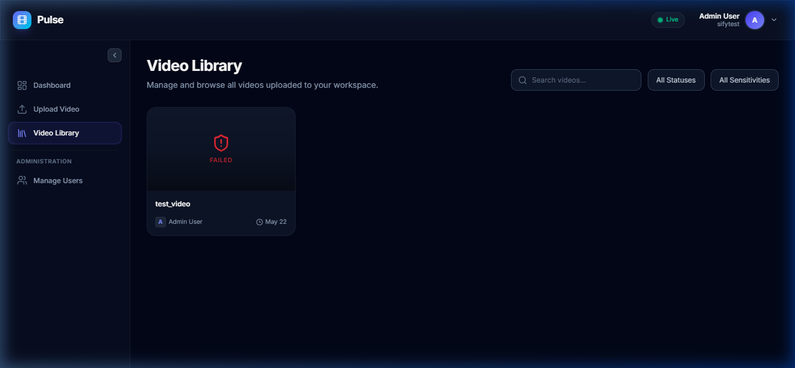
</p>

---

###  12. Video Player & Details
<p align="center">
  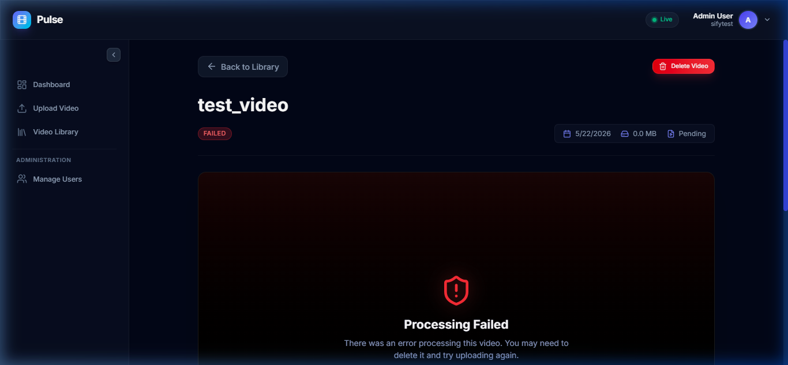
</p>

---


##  User Manual


### User Roles (RBAC)
Pulse uses a strictly enforced Role-Based Access Control system isolated by `organisation`.
- **Viewer**: Read-only access. Can browse the Video Library, view the dashboard, and stream videos.
- **Editor**: Can do everything a Viewer can, plus upload new videos and delete their *own* videos.
- **Admin**: Full system access. Can manage users in their organisation (approve registrations, change roles) and delete *any* video in the organisation.

### Complete User Journey
1. **Registration**: 
   - A new user registers an "Organisation" (becomes the Admin).
   - Other users register under that same Organisation Name (Wait for Admin approval).
2. **Dashboard**: Users view real-time statistics of total videos, storage used, and videos flagged for sensitive content.
3. **Uploading**: Editors/Admins drag and drop a video. Real-time progress bars indicate the status of the background processing pipeline.
4. **Streaming**: Clicking a processed video opens the custom media player. Users can click the "Settings" gear to switch between 720p and 360p adaptive qualities.

---

##  Installation & Setup Guide

### Prerequisites
- Node.js (v18+ recommended)
- MongoDB locally installed OR a MongoDB Atlas Cluster URI
- FFmpeg installed on your system (The backend uses `@ffmpeg-installer/ffmpeg` so it is bundled automatically, but a native installation is recommended for local development).

### 1. Clone the Repository
```bash
git clone https://github.com/lokesh9999b/Video_Analyser.git
cd Video_Analyser
```

### 2. Backend Setup
```bash
cd backend
npm install
```
Create a `.env` file in the `backend` directory:
```env
PORT=5000
NODE_ENV=development
CLIENT_URL=http://localhost:5174
MONGO_URI=your_mongodb_connection_string
JWT_SECRET=your_super_secret_jwt_key
GOOGLE_VISION_API_KEY=your_google_cloud_api_key
```
Start the backend server:
```bash
npm run dev
```

### 3. Frontend Setup
```bash
cd frontend
npm install
```
Create a `.env` file in the `frontend` directory:
```env
VITE_API_URL=http://localhost:5000/api
```
Start the frontend server:
```bash
npm run dev
```

### 4. Running Tests
The backend includes an automated Jest test suite to verify core endpoints.
```bash
cd backend
npm test
```

---

##  API Documentation

| Method | Endpoint | Description | Role Required |
| :--- | :--- | :--- | :--- |
| **POST** | `/api/auth/register/org` | Register a new organisation and Admin user. | Public |
| **POST** | `/api/auth/register/user`| Register a new user under an existing org. | Public |
| **POST** | `/api/auth/login` | Authenticate and receive JWT. | Public |
| **GET** | `/api/users/pending` | List users awaiting admin approval. | Admin |
| **PUT** | `/api/users/:id/status` | Approve or reject a pending user. | Admin |
| **GET** | `/api/videos/stats` | Get dashboard statistics (Cached). | Authenticated |
| **GET** | `/api/videos` | List videos with pagination/filters (Cached). | Authenticated |
| **POST** | `/api/videos/upload` | Upload a `multipart/form-data` video. | Editor, Admin |
| **DELETE**| `/api/videos/:id` | Delete a video and its physical files. | Editor (Own), Admin |
| **GET** | `/api/videos/:id/stream`| Stream video via HTTP Range Requests. Accepts `?quality=720p` or `360p`. | Authenticated |

---

##  Assumptions & Design Decisions

1. **AI Sensitivity Analysis: Google Cloud Vision**
   - *Decision:* Replaced local `nsfwjs` (TensorFlow) with the Google Cloud Vision API.
   - *Reasoning:* Local machine learning models consume massive amounts of RAM (often exceeding free-tier hosting limits) and take minutes to initialize. By offloading this to Google Cloud, the backend remains incredibly lightweight. Furthermore, Google provides enterprise-grade detection for violence and gore, which standard NSFW models miss.

2. **Performance Optimization: Node-Cache**
   - *Decision:* Implemented an in-memory caching layer (`node-cache`) for the Dashboard and Library endpoints.
   - *Reasoning:* These endpoints require complex MongoDB aggregation queries. Caching the responses drastically reduces database load. The cache is automatically invalidated whenever an Editor uploads or deletes a video to ensure data consistency.

3. **Data Storage: Local vs Cloud**
   - *Decision:* Videos are stored on the local disk (`/uploads`, `/processed`).
   - *Reasoning:* While AWS S3 is standard for production, local storage was chosen to keep the assignment portable and easy to run locally without requiring reviewers to set up complex IAM roles and cloud buckets. 

4. **Multi-Tenant Data Isolation**
   - *Decision:* Utilized a single-database design with a mandatory `organisation` field on all Users and Videos.
   - *Reasoning:* Instead of provisioning separate databases per tenant (which doesn't scale well), every query in the backend controllers forces a strict match on `req.user.organisation`. This guarantees completely secure data segregation between tenants at the application layer.

5. **Video Compression & Streaming**
   - *Decision:* Uploaded videos are transcoded into two MP4 variants (720p and 360p) using `libx264` and the `-movflags +faststart` FFmpeg option.
   - *Reasoning:* `faststart` moves the moov atom to the beginning of the file, allowing the browser's HTML5 video player to begin streaming immediately via HTTP range requests without needing to download the entire file first. Providing a 360p fallback allows users on slower connections to stream without buffering.
